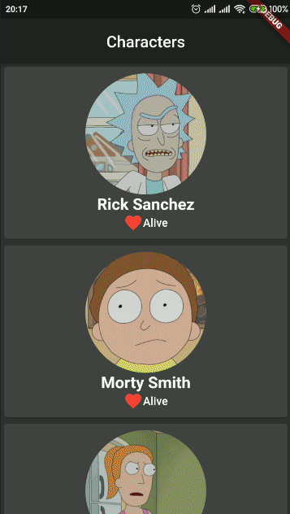

# assignment_06

## Rick & Morty app ⭐

* All characters from Rick & Morty.
* Press long to see character details.
* Press  to see list of episodes in which this character appeared.
* Press to see episode details. 

## Getting Started

A few resources to get you started if this is your first Flutter project:

- [Lab: Write your first Flutter app](https://flutter.dev/docs/get-started/codelab)
- [Cookbook: Useful Flutter samples](https://flutter.dev/docs/cookbook)

For help getting started with Flutter, view our
[online documentation](https://flutter.dev/docs), which offers tutorials,
samples, guidance on mobile development, and a full API reference.
